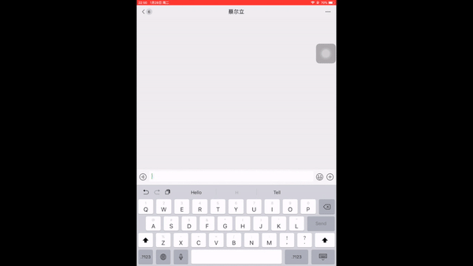

# This is a chatbot that helps you to :
 1 Get inforrmation of an artist   
 2 Get songs from an artist   
 3 Help you to find similar artist

 This chatbot is built using rasa_nlu, SQLite, spacy and genius API from rapidAPI  
 rasa_nlu helps with training data and, together with regular expression, extract intent of a sentence  
 SQLite helps with creating a database and search for artist match for the parameters (County and Genre)  
 spacy helps with finding entities  
 genius API provide easy access to datas like artist's besk known songs, lyrics of each song, artist activities.
